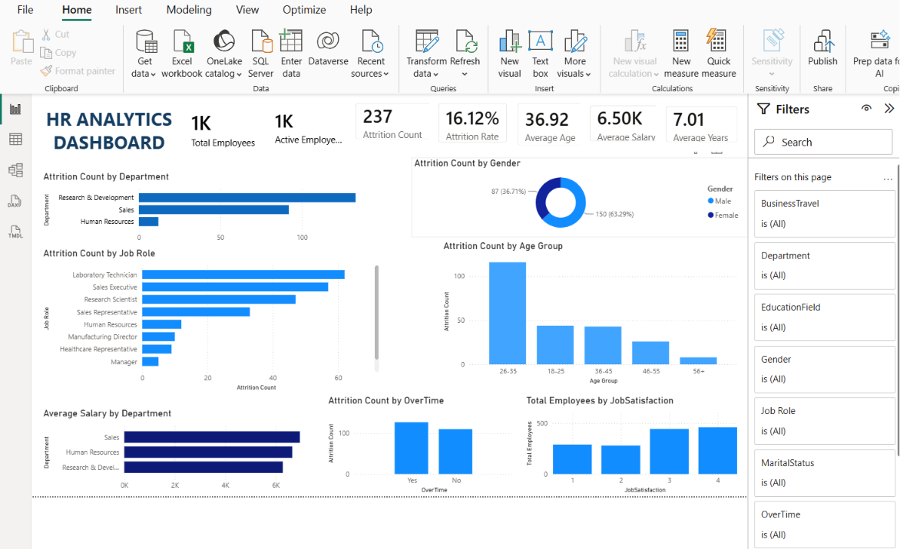

# HR Analytics Dashboard using Power BI

## Project Overview

This project presents an interactive HR Analytics Dashboard developed using Microsoft Power BI. The dashboard helps analyze employee attrition, workforce demographics, salary distribution, job roles, and other HR metrics to support data-driven decision-making.

---

## 📷 Dashboard Preview

---

## Features

- Interactive Power BI Dashboard
- Employee Attrition Analysis
- Department-wise Insights
- Salary Analysis
- Age Group Analysis
- Education-wise Attrition
- Job Role Analysis
- Dynamic Filters and Slicers
- KPI Cards

---

## Tools & Technologies

- Microsoft Power BI
- Power Query
- DAX
- Data Modeling
- Data Visualization

---

## KPIs

- Total Employees
- Attrition Count
- Attrition Rate
- Active Employees
- Average Age

---

## Insights

- Identify departments with high attrition.
- Analyze employee demographics.
- Compare salary and attrition trends.
- Understand workforce distribution.
- Support HR decision-making using data.

---

## Skills Demonstrated

- Data Cleaning
- Data Transformation
- Dashboard Design
- DAX Calculations
- Business Intelligence
- Data Visualization

---

## Project File

- HR Analytics Dashboard.pbix

---

## 📁 Repository Structure

- 📊 HR.pbix – Power BI Dashboard
- 🖼️ HR_Analytics_Dashboard.png – Dashboard Preview
- 📄 WA_Fn-UseC_-HR-Employee-Attrition.csv – Dataset
- 📘 README.md – Project Documentation
- 📜 LICENSE – MIT License

## Author

Sai Shankar Yengla

LinkedIn:
(https://www.linkedin.com/in/saishankar-yengla/)
